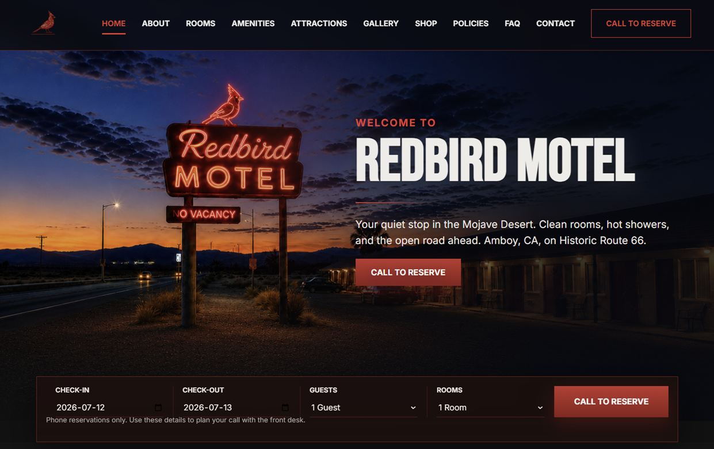

<p align="center">
  <h1 align="center">Redbird Motel</h1>

  <p align="center">
    Inspired by Historic Route 66.<br>
    Timeless roadside charm.
  </p>

  <p align="center">
    A timeless stop along the open road.
  </p>

  <p align="center">
    <a href="https://www.redbirdmotel.com">🌐 Website</a> •
    <a href="https://x.com/redbirdmotel">𝕏 X</a> •
    <a href="https://www.instagram.com/redbirdmotel">Instagram</a> •
    <a href="https://www.pinterest.com/redbirdmotel">Pinterest</a> •
    <a href="https://www.youtube.com/@redbirdmotel">YouTube</a>
  </p>
</p>

---

## 📸 Preview

<p align="center">
  
</p>

---

## Overview

Redbird Motel is an independent creative brand inspired by the timeless roadside culture of Historic Route 66.

Through design, storytelling, collectibles, and digital experiences, the project captures the nostalgia of America's classic roadside motels and the spirit of the open road.

Rather than recreating a destination, Redbird Motel recreates a feeling.

### 🌐 Visit the Website

https://www.redbirdmotel.com

---

## Features

- Vintage Route 66 inspired visual identity
- Responsive static website
- Brand story and About page
- Gift Shop featuring collectible products
- Gallery and roadside atmosphere
- FAQ and Contact pages
- Mobile-friendly design
- SEO optimized
- Google Analytics 4 integration
- GitHub Pages deployment

---

## Design Inspiration

Redbird Motel is inspired by the atmosphere, places, and memories that define the American open road.

- Historic Route 66
- Mojave Desert
- Vintage Neon Signs
- Classic American Roadside Motels
- Desert Sunsets
- Endless Highways
- Quiet Coffee Stops
- The Spirit of the Open Road

---

## Philosophy

Inspired by the quiet beauty of the Mojave Desert, vintage neon signs, and the enduring spirit of Historic Route 66.

Every page, illustration, and collectible is designed to evoke the feeling of arriving at a forgotten roadside motel after a long drive through the desert.

Redbird Motel is built around atmosphere, memory, and the romance of the open road.

---

## Technology

- HTML5
- CSS3
- Vanilla JavaScript
- GitHub Pages
- Google Analytics 4

---

## Project Structure

```text
.
├── about/
├── shop/
├── assets/
├── index.html
├── styles.css
├── script.js
├── favicon.ico
├── robots.txt
├── sitemap.xml
├── CNAME
├── screenshot.png
└── README.md
```

---

## Explore

- 🌐 Website  
  https://www.redbirdmotel.com

- 🛍 Shop  
  https://www.redbirdmotel.com/shop/

- 📖 About  
  https://www.redbirdmotel.com/about/

- 𝕏 X  
  https://x.com/redbirdmotel

- 📸 Instagram  
  https://www.instagram.com/redbirdmotel

- 📌 Pinterest  
  https://www.pinterest.com/redbirdmotel

- ▶️ YouTube  
  https://www.youtube.com/@redbirdmotel

---

## License

Copyright © 2026 Redbird Motel.

All rights reserved.

---

<p align="center">

Inspired by Historic Route 66.

Timeless roadside charm.

© 2026 Redbird Motel

</p>